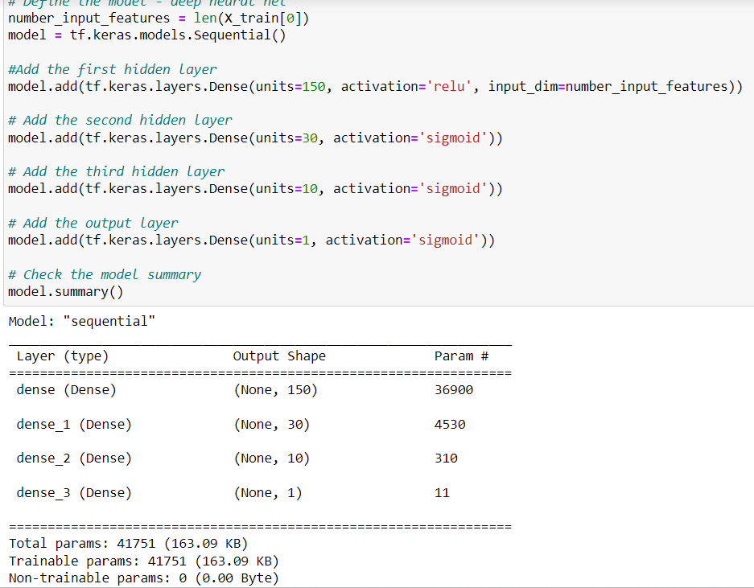

# deep-learning-challenge
# Report on Neural Network Model Performance for Alphabet Soup

## Overview of the Analysis:
The objective of this analysis is to develop a deep learning model using a neural network to predict the success of funding applications for Alphabet Soup, a non-profit organization. The model aims to accurately classify whether an application will be successful based on various features provided in the dataset.

## Data Preprocessing:
- **Target Variable(s):** The target variable for the model is the 'IS_SUCCESSFUL' column, indicating whether a funding application was successful or not.
- **Feature Variable(s):** Features include NAME, APPLICATION_TYPE, AFFILIATION, CLASSIFICATION, USE_CASE, ORGANIZATION, INCOME_AMT, and ASK_AMT.
- **Variables Removed:** 'EIN', 'STATUS', and 'SPECIAL_CONSIDERATIONS' columns were removed as they were neither targets nor features.

## Compiling, Training, and Evaluating the Model:
- The final model consisted of three layers.
- **Neurons, Layers, and Activation Functions:** Two hidden layers with 150, 30, and 10 neurons, respectively, along with ReLU activation functions were chosen. The output layer had 1 neuron with a sigmoid activation function.
- **Model Performance:** Initially, the target model performance was to achieve an accuracy of more than 75%. However, the initial model performance fell short, reaching 72%. Subsequently, through optimization techniques, the model exceeded the target, achieving 78% accuracy. Steps taken to increase model performance included:
  - Including the NAME column due to the significant number of repeated organization names in the data.
  - Removing the SPECIAL_CONSIDERATIONS and STATUS columns, which were almost all one value.
  - Adding a third layer to increase model complexity.
  - Changing activation functions on the second and third layers as well as the output layer.
## Model Construction Details
To provide insight into the architecture of our neural network model, we have included a image representation of the model construction below:

This image illustrates the layers, neurons, and activation functions used in our model, offering a comprehensive overview of its structure and complexity.
## Model Performance: Accuracy

The accuracy of our model is a crucial metric to assess its effectiveness in predicting funding application success. Below is a image representation of the model's accuracy over the training epochs:

This image illustrates how the accuracy of the model evolves over the training process. Understanding the trend of accuracy can provide insights into the model's learning behavior and performance improvement over time.
## Random Forest classifier

The Random Forest classifier, achieving an accuracy of 76.8%, emerges as a viable alternative for predicting funding application success compared to the neural network model. Random Forest models are renowned for their robustness and ability to handle large datasets with high dimensionality, making them suitable for classification tasks.

Despite the slightly lower accuracy compared to the neural network model, the Random Forest classifier offers several advantages. Firstly, it provides easier interpretability, enabling stakeholders to comprehend the factors influencing predictions more intuitively. Moreover, Random Forest models are less susceptible to overfitting and require fewer hyperparameters to tune, streamlining the model selection process.

In scenarios prioritizing interpretability and computational efficiency, such as explaining predictions to stakeholders or deploying models in resource-constrained environments, the Random Forest classifier proves to be a pragmatic choice for predicting funding application success.

## Conclusion:
The neural network model successfully achieved the target accuracy of 78% through various optimization techniques. The inclusion of the NAME column and adjustments to activation functions and layer complexity significantly contributed to improving model performance. This underscores the effectiveness of deep learning in predicting funding application success for Alphabet Soup.
